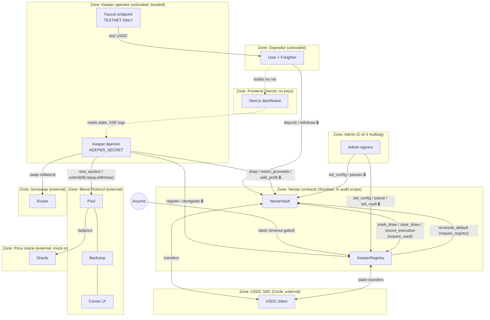
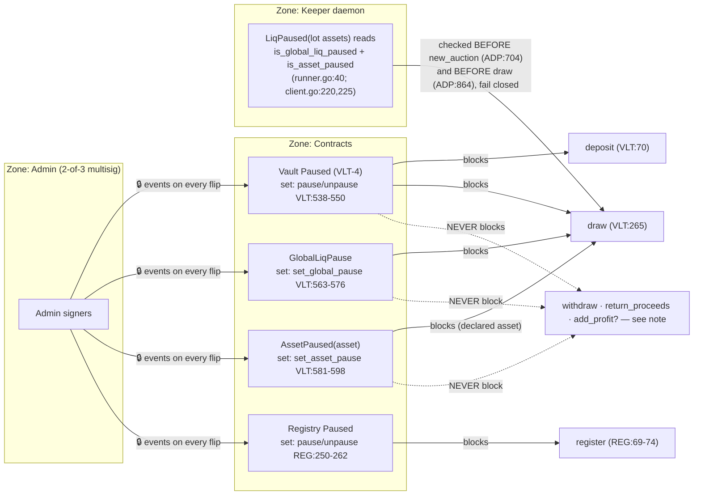
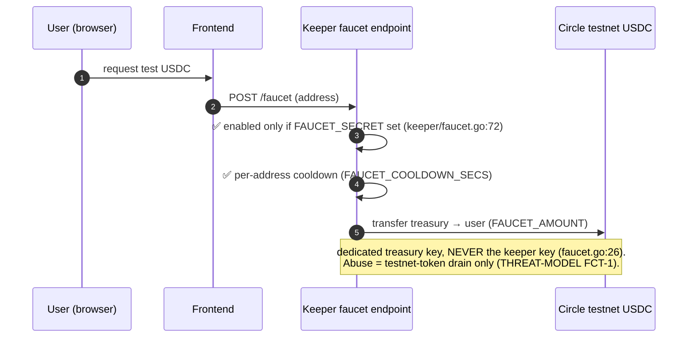

# Nectar Network — Data Flow & Trust Boundaries (audit-freeze-v1)

Companion to [THREAT-MODEL.md](./THREAT-MODEL.md). Every diagram was spot-checked
edge-by-edge against the source at tag **`audit-freeze-v1`** (commit `dbf0e5c`);
the liquidation sequence is the one proven live in
[`docs/evidence/b-full-cycle.md`](../evidence/b-full-cycle.md) (tx-hashed), updated
for the T3 draw signature — not the pre-verification spec wording.

Line references: `VLT:` = `contracts/nectar-vault/src/lib.rs`, `REG:` =
`contracts/keeper-registry/src/lib.rs`, `ADP:` = `keeper/adapters/blend/adapter.go`
— all at the frozen tag.

**Legend:** 🔒 = `require_auth` (signature) · ✅ = on-chain validation · each
`subgraph` is a trust zone; every external system is its own zone.

---

## 0. Zone map (all trust boundaries at a glance)



The vault and registry pin each other: the registry accepts vault-only calls solely
from the address set once via `set_vault` (REG:51-60, 440-451); the vault accepts
`reconcile_default` solely from its constructor-stored registry (VLT:758-769).
Neither contract ever invokes a caller-supplied address.

---

## 1. Deposit

```mermaid
sequenceDiagram
    autonumber
    participant U as User 🔒
    participant V as NectarVault
    participant T as USDC SAC

    U->>V: deposit(user, amount)  🔒 user.require_auth (VLT:71)
    V->>V: ✅ init + not VLT-4-paused (VLT:69-70)
    V->>V: ✅ deposit_cap (VLT:89-91)
    V->>V: shares = virtual-offset floor (VLT:95); ✅ reject 0 shares (VLT:98-100)
    V->>T: transfer user → vault (VLT:102)
    V->>V: persist Depositor (+shares, last_deposit_time=now); total_usdc/shares += (VLT:104-127)
    V-->>U: emit "deposit"(amount, shares) (VLT:129-132)
```

**Boundary:** B1 depositor→vault. Liquidation pause flags are NOT in this path —
deposit is governed by the VLT-4 pause only.

---

## 2. Withdraw (cooldown + rate limit in the path)

```mermaid
sequenceDiagram
    autonumber
    participant U as User 🔒
    participant V as NectarVault
    participant T as USDC SAC

    U->>V: withdraw(user, shares)  🔒 user.require_auth (VLT:140)
    Note over V: NO pause flag of any kind is read in this path —<br/>withdraw works during VLT-4 pause AND liquidation pauses
    V->>V: ✅ shares ≤ depositor.shares (VLT:149-151)
    V->>V: ✅ cooldown: now − last_deposit_time ≥ withdraw_cooldown (VLT:158-161)
    V->>V: usdc_out = virtual-offset floor, CLAMPED to total_usdc (VLT:184-185)
    V->>V: ✅ rate limit (if max_withdraw_per_24h > 0):<br/>reset window if now − window_start ≥ 86400;<br/>reject if withdrawn_in_window + usdc_out > cap (VLT:191-200)
    V->>V: CEI: burn shares, decrement totals, persist (VLT:202-212)
    V->>T: transfer vault → user (VLT:219)
    V-->>U: emit "withdraw"(shares, usdc_out) (VLT:221-224)
```

**Order matters (all pre-commit):** auth → ownership → cooldown → payout computation
(with the anti-underflow clamp) → fixed-window rate limit → CEI state commit →
token transfer. A rejected withdrawal mutates nothing. The rate limit meters the
USDC actually leaving (`usdc_out`), not the share count.

---

## 3. Full liquidation cycle (as shipped and proven live)

This is the verified sequence from `b-full-cycle.md` (share price 1.0000000 →
1.0432672, every step tx-hashed), with the T3 draw signature at the frozen tag.

```mermaid
sequenceDiagram
    autonumber
    participant K as Keeper daemon 🔒
    participant V as NectarVault
    participant R as KeeperRegistry
    participant B as Blend pool (external)
    participant S as Soroswap (external)

    K->>B: event index sync + get_positions probe → HF < 1 detected
    K->>B: FindLiquidationPercent — read-only new_auction sims (pool is the authority)
    K->>V: ✅ pause pre-check: LiqPaused(ALL lot assets), fail closed (ADP:704)
    K->>B: new_auction(type 0, borrower, percent)
    Note over K,B: wait on the verified two-phase 400-ledger curve<br/>until lot/bid ≥ MIN_PROFIT (1.02)
    K->>V: ✅ pause re-check before capital commit (ADP:864)
    K->>V: draw(keeper, amount, asset)  🔒 (VLT:262-267)
    V->>V: ✅ not VLT-4-paused (VLT:265); ✅ global + per-asset liq pause (VLT:266, 736-756)
    V->>V: ✅ amount > 0 (VLT:277-279); ✅ amount ≤ total_usdc − active_liq (VLT:292-295)
    V->>V: ✅ CUMULATIVE cap: prev + amount ≤ max_draw_per_keeper (VLT:297-309)
    V->>R: verify_keeper — registered + active + stake ≥ min_stake (VLT:311; REG:196-218)
    V->>V: CEI: DrawInfo{prev+amount, since=now}; active_liq += (VLT:320-331)
    V->>K: transfer vault → keeper (VLT:338)
    V->>R: mark_draw — require_vault; last_draw_time = now (VLT:344; REG:264-283)
    V-->>K: emit "draw"(amount, asset) (VLT:346-347)
    K->>B: ONE atomic submit([FillUserLiquidation, Repay(gross), WithdrawCollateral])
    Note over K,B: single health check at the end — either keeper exits<br/>with tokens and no debt, or nothing happened
    K->>S: swap seized collateral → USDC (oracle-anchored floor + amount_out_min)
    K->>V: return_proceeds(keeper, amount, response_ms)  🔒 (VLT:356-364)
    V->>V: ✅ NoDraw guard: outstanding draw required (VLT:370-381)
    V->>K: transfer keeper → vault (VLT:389)
    V->>V: repay = min(amount, drawn, active_liq); profit = amount − min(amount, drawn) (VLT:396-409)
    alt fully settled
        V->>V: remove DrawInfo (VLT:433)
        V->>R: clear_draw + record_execution(success, profit, ms) (VLT:434-435)
    else partial return
        V->>V: keep DrawInfo{remaining, since UNCHANGED} — stays slash-eligible (VLT:412-430)
    end
    V-->>K: emit "return"(amount, profit) (VLT:439-442)
```

**Boundaries crossed:** B5 (keeper↔Blend/Soroswap — nothing those zones return can
move vault funds), B2 (keeper↔vault, twice), B3 (vault↔registry, three calls).
The vault never talks to Blend, the DEX, or any oracle.

---

## 4. Bad-debt float path (shipped; operator capital only)

```mermaid
sequenceDiagram
    autonumber
    participant K as Keeper daemon 🔒
    participant B as Blend pool + backstop (external)
    participant CM as Comet LP (external)
    participant V as NectarVault

    K->>B: backstop position scan → bad debt found
    Note over K: capital source = KEEPER FLOAT (BAD_DEBT_MAX_SPEND cap).<br/>NEVER a vault draw — the LP lot is illiquid pre-mainnet<br/>and a draw would hit slash_timeout.
    alt t < 400 on the curve
        K->>B: create bad-debt auction (settle-asset legs only)
        K->>B: atomic submit([FillBadDebt, Repay]) from float
    else t ≥ 400 (bid empty)
        K->>B: free-capture: bare submit([FillBadDebt]) — no debt assumed
    end
    B->>K: backstop LP tokens (lot) → held BY THE OPERATOR
    Note over K,CM: mainnet unwind (T3): one verified comet call<br/>wdr_tokn_amt_in_get_lp_tokns_out → Circle USDC.<br/>Cost convex in size; single call ≈ pool-USDC/3 cap.
    K--xV: NOT WIRED YET (Session H): unwound USDC → add_profit
```

Honest status (CORRECTION-REPORT limitation 2 + Gap 4): at this tag, bad-debt
profit accrues to the **operator**, not depositors. The contract-side credit path
(`add_profit`, flow 5) exists and is frozen for audit; the keeper-side wiring —
unwind → `add_profit` — is Session H work. No document should claim the
depositor-credit loop is closed until that wiring ships.

---

## 5. add_profit — registration-gated donation (shipped at this tag)

```mermaid
sequenceDiagram
    autonumber
    participant K as Registered keeper 🔒
    participant V as NectarVault
    participant R as KeeperRegistry
    participant T as USDC SAC

    K->>V: add_profit(keeper, amount)  🔒 (VLT:463-466)
    Note over V: NOT pause-gated (like return_proceeds):<br/>money in is always safe
    V->>V: ✅ amount > 0 (VLT:468-470)
    V->>R: verify_keeper — bonded, active, stake ≥ min_stake > 0 (VLT:471; REG:196-218)
    V->>V: ✅ total_shares > 0 — donations need holders (VLT:482-484)
    V->>T: transfer keeper → vault (VLT:491)
    V->>V: total_usdc += ; total_profit += ; NO shares minted;<br/>draw accounting / cooldowns / rate windows untouched (VLT:493-495)
    V-->>K: emit "profit_added" — DISTINCT from "return" (VLT:497-498)
```

This is the deliberate, gated counterpart to the path VLT-2's `NoDraw` guard blocks
for anonymous callers in `return_proceeds`. Share price rises for existing holders
only; the `profit_added` event keeps donated profit separable in accounting.

---

## 6. Registration, staking, slashing

```mermaid
sequenceDiagram
    autonumber
    participant O as Operator 🔒
    participant A2 as Anyone (permissionless)
    participant R as KeeperRegistry
    participant V as NectarVault
    participant T as USDC SAC

    O->>R: register(operator, name)  🔒 (REG:62-76)
    R->>R: ✅ not Paused (REG:69-74); ✅ not already registered (REG:79-81); ✅ min_stake > 0 (REG:84-86)
    R->>T: stake: transfer operator → registry, exactly min_stake (REG:89-93)
    R->>R: KeeperInfo{stake, active: true, counters zeroed} (REG:95-121)
    R-->>O: emit "registered" (REG:123-126)

    Note over O,R: deregister 🔒 refunds stake — BLOCKED while has_active_draw (REG:146-148)

    A2->>R: slash(keeper) — no auth required (REG:338)
    R->>R: ✅ has_active_draw (REG:350-352); ✅ now − last_draw_time > slash_timeout (REG:354-357)
    R->>R: slash_amt = stake × slash_rate_bps / 10000 (REG:359)
    R->>T: transfer registry → VAULT (recovery) (REG:361-366)
    R->>R: stake −= ; has_active_draw = false; active = FALSE —<br/>deactivated, must re-stake to ever draw again (REG:367-375)
    R->>V: reconcile_default(registry, keeper, recovered)  ✅ require_registry (REG:385-394; VLT:620-628)
    V->>V: clear DrawInfo; active_liq −= ; write down loss = outstanding − recovered,<br/>CLAMPED at total_usdc ≥ 0 (VLT:630-670)
    Note over R,V: ATOMIC — if the vault rejects, the whole slash reverts (no drift)
    V-->>A2: emit "write_off"(outstanding, recovered) (VLT:672-675)
    R-->>A2: emit "slashed"(slash_amt, remaining_stake) (REG:396-399)
```

---

## 7. Pause propagation — who sets, who reads, what stops



Exact gating at the tag — who reads each flag and what it stops:

| Flag | Set by | Read on-chain at | Stops | Never stops |
|---|---|---|---|---|
| `Paused` (VLT-4) | admin `pause`/`unpause` (VLT:538-550) | `deposit` (VLT:70), `draw` (VLT:265) via `require_not_paused` (VLT:724-734) | deposit, draw | **withdraw** (no read in path), return_proceeds, add_profit, reconcile_default |
| `GlobalLiqPause` | admin `set_global_pause` (VLT:563-576, event `liq_pause`) | `draw` only, via `require_liq_allowed` (VLT:266, 736-746) | ALL draws regardless of declared asset | everything else — depositor exit invariant (VLT:559-562) |
| `AssetPaused(asset)` | admin `set_asset_pause` (VLT:581-598, event `asset_pause`) | `draw` only (VLT:747-755), against the keeper-DECLARED asset | draws declaring that asset (honest keepers hard-gated; misdeclaration = THREAT-MODEL T3-1) | everything else |
| Registry `Paused` | admin `pause`/`unpause` (REG:250-262) | `register` (REG:69-74) | new registrations | deregister, slash, vault-only calls |

The keeper additionally reads the two liquidation flags off-chain for ALL lot
assets and fails closed on read errors — before creating an auction and again
before committing capital (ADP:704, 864) — so a paused system stops producing
on-chain noise it can never act on.

---

## 8. Faucet (TESTNET ONLY — does not exist on mainnet)



---

## Data entities crossing boundaries

| Entity | Lives in | Crosses a boundary at |
|---|---|---|
| USDC | SAC balances (external zone) | deposit, withdraw, draw, return, add_profit, stake, slash recovery, faucet (testnet) |
| Shares | Vault persistent `Depositor` | deposit (mint), withdraw (burn) — never transferable |
| `DrawInfo{amount, since}` | Vault persistent | draw (+/stamp), partial return (amount only — `since` preserved), full return / reconcile (remove) |
| `active_liq` | Vault instance `VaultState` | draw (+), return (−, capped per-keeper), reconcile (−) |
| Rate-limit window (`window_start`, `withdrawn_in_window`) | Vault persistent `Depositor` | withdraw only, and only while `max_withdraw_per_24h > 0` |
| Pause flags | Vault/registry instance | set by admin; read by draw/deposit/register paths + keeper (off-chain) |
| Stake | Registry persistent `KeeperInfo` | register (+), deregister (refund), slash (− → vault) |
| `has_active_draw` / `last_draw_time` | Registry `KeeperInfo` | mark_draw (set), clear_draw (unset), slash (unset + deactivate) |
| Performance counters | Registry `KeeperInfo` | record_execution (vault-only, saturating) |
| Positions / auctions / prices | Blend + oracle (external zones) | read by the keeper only — never enter either contract |

## External trust zones — what they can and cannot do

Blend, Soroswap, the comet, and the oracle are outside the Nectar boundary. The
keeper is the only component that talks to them, and nothing they return can move
vault funds: the vault's only inputs are keeper-signed calls that pass B2's checks
(registration, caps, pauses) and admin-signed config. Oracle risk at this tag is
therefore keeper-capital risk, not vault-solvency risk; the on-chain
cross-referencing breaker (actuating these pause flags) is the Tranche-3 ORA-1
deliverable.
