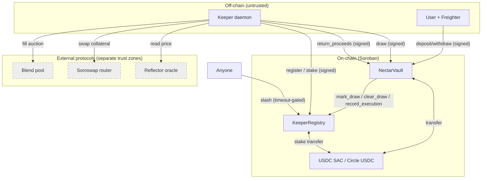

# Nectar Network — STRIDE Threat Model

**Scope:** the two on-chain Soroban contracts (`KeeperRegistry`, `NectarVault`) and their
interaction with the off-chain Go keeper daemon and external protocols (Blend, Soroswap,
Reflector). Prepared for the SCF Audit Bank and the Tranche 3 mainnet launch.

**Version:** 2026-06-22 · **Network:** Stellar testnet (mainnet in Tranche 3) ·
**Functional LOC audited:** ~933 (contracts, excl. tests) — KeeperRegistry 420, NectarVault 513.

> This document is intentionally candid: it lists real weaknesses we found while preparing
> for audit, with existing mitigations and the fixes we plan to land before mainnet. Line
> references are to `contracts/keeper-registry/src/lib.rs` (REG) and
> `contracts/nectar-vault/src/lib.rs` (VLT).

> **Remediation status (2026-06-22):** the findings below were adversarially re-verified, then
> remediated in code; the fixes were adversarially reviewed again (which surfaced and closed an
> additional High, NEW‑drain). **VLT‑1, VLT‑2, VLT‑3, VLT‑4, VLT‑6 and NEW‑cap / NEW‑reconcile /
> NEW‑drain are FIXED** (80/80 tests pass, both contracts build to deployable wasm). Still open
> for Tranche 3: **VLT‑5** (admin multisig), **NEW‑init** (atomic `__constructor`), **ORA‑1**
> (oracle circuit breaker). See [SCOUT-REPORT.md](./SCOUT-REPORT.md) for the per-finding status.

---

## 1. System Overview

### Components
| Component | Type | Role |
|---|---|---|
| **NectarVault** | Soroban contract | Holds pooled USDC; mints/burns shares; lends capital to keepers via `draw`; books profit on `return_proceeds`. |
| **KeeperRegistry** | Soroban contract | Operator registration + USDC staking; tracks executions; slashes delinquent keepers. |
| **Keeper daemon** | Off-chain Go | Monitors Blend positions, decides profitability, calls `draw`/fill/swap/`return_proceeds`. Stateless. |
| **Frontend** | Next.js | Read-only dashboard + Freighter-signed deposit/withdraw. Holds no keys. |
| **USDC token** | SAC | Mock SAC on testnet; **Circle USDC** on mainnet (Tranche 3). |
| Blend pool | External | Liquidation auction source. |
| Soroswap router | External | Collateral → USDC conversion. |
| Reflector oracle | External | Price feed; basis for the Tranche 3 circuit breaker. |

### Trust boundaries
1. **On-chain ↔ off-chain** — the keeper daemon is untrusted from the contract's view; every privileged action requires an on-chain signature and passes contract checks.
2. **User ↔ vault** — users authorize their own deposits/withdrawals only (`user.require_auth()`).
3. **Keeper ↔ vault** — a keeper can `draw` only if registered and within limits; `draw`/`return_proceeds` require the keeper's signature.
4. **Vault ↔ registry** — only the vault may call `mark_draw`/`clear_draw`/`record_execution` (`require_vault`, REG:356). Only the registry-configured vault address is accepted.
5. **Admin ↔ contracts** — a single admin key controls config + registry pause (multisig planned, Tranche 3).
6. **Contracts ↔ external protocols** — Blend/Soroswap/Reflector are separate trust zones; the keeper mediates, never the vault directly.

### Assets to protect
- Pooled vault USDC (`total_usdc`) and the integrity of `active_liq` accounting.
- Keeper stakes held in the registry.
- Share-price integrity (`total_usdc / total_shares`) — every depositor's claim.
- Admin authority (config, pause, future multisig).

---

## 2. Data Flow Diagram

**Trust-boundary crossings (where validation happens):**
- `deposit`/`withdraw`: `user.require_auth()` + cap/cooldown checks (VLT:48,66,133).
- `draw`: `keeper.require_auth()` + draw-limit + available-capital + registry keeper check (VLT:208,215,224,228).
- `return_proceeds`: `keeper.require_auth()` + token pull from keeper (VLT:271,278). **Not** registry-gated (see VLT‑2).
- `mark_draw`/`clear_draw`/`record_execution`: `require_vault` (REG:356) — only the vault.
- `slash`: permissionless, but requires `has_active_draw` + `now − last_draw_time > slash_timeout` (REG:296‑303).

---

## 3. STRIDE Analysis by Component

### 3.1 NectarVault
- **Spoofing** — `deposit`/`withdraw`/`draw`/`return_proceeds` all call `require_auth()` on the acting address; a caller cannot act as another user or keeper. Keeper legitimacy is delegated to the registry (`require_registered_keeper`, VLT:403) — but that helper **discards the result** and only relies on `get_keeper` trapping on a missing record; it does not check `active` (see VLT‑3).
- **Tampering** — share math floors in the pool's favor (VLT:72‑76, 150). This protects existing holders but **enables a share-inflation attack** on new depositors when combined with donatable profit (VLT‑1). `active_liq` is protected against cross-keeper deduction via per-keeper `KeeperDraw` tracking (VLT:288‑304).
- **Repudiation** — every state change emits an event (`deposit`, `withdraw`, `draw`, `return`); actions are auditable.
- **Information disclosure** — no secrets on-chain; all state is intentionally public.
- **Denial of service** — `draw` is bounded by `max_draw_per_keeper` and `available = total_usdc − active_liq`; a single keeper cannot drain the pool in one call. **No emergency pause exists on the vault** (VLT‑4).
- **Elevation of privilege** — `set_config` is admin-gated (VLT:359‑369). A keeper cannot become admin. Single-admin risk tracked as VLT‑5.

### 3.2 KeeperRegistry
- **Spoofing** — `register`/`deregister` require the operator's auth (REG:48,111). `mark_draw`/`clear_draw`/`record_execution` require the vault's auth (`require_vault`, REG:356). Admin functions require admin auth (`require_admin`, REG:343).
- **Tampering** — performance counters use `saturating_add` (REG:264‑271), no overflow. Stakes are only moved by `register` (in), `deregister` (refund), `slash` (to vault).
- **Repudiation** — `registered`, `deregistered`, `draw_marked`, `draw_cleared`, `execution`, `slashed` events cover all transitions.
- **Information disclosure** — none (public metrics by design).
- **Denial of service** — `register` respects a `Paused` flag (REG:41‑46); `slash` is permissionless but self-limiting (after a slash, `has_active_draw=false`, so it can't be re-run — REG:296).
- **Elevation of privilege** — admin config changes are gated; the only cross-contract writer is the configured vault. Governance risk is the single admin key (VLT‑5 / REG‑2).

### 3.3 Keeper daemon (off-chain)
- **Spoofing** — holds `KEEPER_SECRET`; compromise = that operator's stake at risk (bounded by stake + slashing), not the pool. Panic-isolated per adapter.
- **Tampering / DoS** — stateless; restarts safely; retries are gated so a broadcast-but-unknown swap is never re-sent (no double-sell). Cannot exceed on-chain limits regardless of bugs.
- **Elevation** — cannot bypass any contract check; the contracts are the source of truth.

### 3.4 Cross-contract interaction (Vault → Registry)
- Only the vault address stored at registry init is accepted as `caller` (`require_vault`). The vault forwards `env.current_contract_address()` and the sub-call carries the vault's auth. A third party cannot forge `mark_draw`/`clear_draw`.

---

## 4. Identified Threats

| ID | Component | STRIDE | Threat | Severity | Status / Mitigation |
|---|---|---|---|---|---|
| **VLT‑1** | Vault | Tampering | **Share-inflation / first-depositor attack.** First deposit mints shares 1:1 with no dead-shares floor; `return_proceeds` with no prior draw treats the whole amount as donated profit (VLT:305‑310), inflating `total_usdc` without minting shares. A later depositor's `amount × total_shares / total_usdc` (VLT:72‑76) rounds to **0 shares**, gifting their deposit to the attacker's share. | **High** | **Open — fix before mainnet.** Plan: virtual shares/assets offset (OZ ERC‑4626 style) **or** mint dead-shares on first deposit **and** a minimum first-deposit. Also VLT‑2 removes the donation vector. |
| **VLT‑2** | Vault | Spoofing/Tampering | **`return_proceeds` is not gated to registered keepers.** Any address can call it (`keeper.require_auth()` only, VLT:271) and, with `drawn == 0`, donate USDC booked as `total_profit` (VLT:305). Enables VLT‑1 and lets non-keepers distort share price/metrics. | **Medium** | **Open.** Plan: require the caller be a registered keeper **with** an outstanding `KeeperDraw > 0`; reject unsolicited donations (or route them explicitly). |
| **VLT‑3** | Vault | Spoofing | **Keeper verification discards the result.** `require_registered_keeper` (VLT:403‑415) invokes `get_keeper` and ignores the return — it relies on the sub-call *trapping* on a missing record and never checks `active`. Fragile and implicit. | **Medium** | **Open.** Plan: bind the returned `KeeperInfo`, assert `active == true` and (optionally) `stake ≥ min`, and handle the error explicitly. |
| **VLT‑4** | Vault | DoS | **No emergency pause on the vault.** The registry has `pause/unpause` (REG:195) but the vault has none; deposits/draws can't be halted during an incident. | **Medium** | **Open — Tranche 3 hardening.** Plan: add admin `pause` gating `deposit`/`draw` (and, ideally, a per-asset oracle circuit-breaker pause). |
| **VLT‑5** | Both | Elevation | **Single admin key.** `set_config`, registry `pause`, and parameter changes hinge on one key; compromise re-parameterizes the protocol. | **Medium** | **Open — Tranche 3.** Plan: 2‑of‑3 admin multisig for all privileged ops; timelock on config changes. |
| **VLT‑6** | Vault | Tampering | **CEI ordering in `draw`.** USDC is transferred to the keeper (VLT:235) *before* `active_liq += amount` (VLT:245). A reentrant token could observe stale `available`. | **Low** | **Mitigated** (trusted SAC / Circle USDC is non-reentrant) + `require_auth`. Plan: reorder to effects-before-interactions for defense in depth. |
| **REG‑1** | Registry | DoS | Permissionless `slash`. | **Info** | **By design & safe** — gated by `has_active_draw` + `slash_timeout`; self-limiting (single slash per draw). Documented so auditors don't mis-flag it. |
| **REG‑2** | Registry | Elevation | Admin can set `slash_rate_bps`, `min_stake`, `slash_timeout` arbitrarily via `set_config`. | **Low/Med** | Bundled with VLT‑5 (multisig + timelock). |
| **ORA‑1** | Keeper/ext | Tampering | **Oracle manipulation → bad liquidation** (the Feb‑2026 YieldBlox class of attack). Keeper valuations depend on price feeds. | **Med/High** | **Tranche 3 deliverable** — Reflector cross-reference circuit breaker; auto-pause on deviation. |
| **DEX‑1** | Keeper/ext | Tampering | **Swap slippage / sandwich** during collateral → USDC. | **Low/Med** | **Mitigated** — oracle-anchored min-out + on-chain `amount_out_min` (default 1%); never falls back after a sent-but-unknown swap. |
| **INT‑1** | Vault | Tampering | Integer overflow in share/profit math. | **Low** | **Mitigated** — i128 with pool-favoring floors; registry counters use `saturating_add`. Audit to confirm no overflow on extreme `total_usdc`. |
| **FR‑1** | Vault | Tampering | Deposit/withdraw front-running around a large `return_proceeds` (MEV on share price). | **Low** | Partly mitigated by `withdraw_cooldown`; note for audit. |

---

## 5. Trust Boundaries — Actor Capability Matrix

| Action | User | Keeper (registered) | Anyone | Admin | Vault (contract) |
|---|---|---|---|---|---|
| deposit / withdraw own funds | ✅ (own, cooldown) | ✅ | ❌ | ✅ | — |
| draw vault capital | ❌ | ✅ (≤ limit, ≤ available) | ❌ | ❌ | — |
| return_proceeds | ❌* | ✅ | ⚠️ *(VLT‑2)* | ❌ | — |
| register / stake | ✅ | ✅ | ✅ (becomes keeper) | — | — |
| slash a keeper | ✅ (if timed out) | ✅ | ✅ (timeout-gated) | ✅ | — |
| mark_draw / clear_draw / record_execution | ❌ | ❌ | ❌ | ❌ | ✅ only |
| set_config / pause | ❌ | ❌ | ❌ | ✅ | — |

\* Today any address can call `return_proceeds` for itself — VLT‑2 tightens this.

---

## 6. Residual Risks (accepted or audit-bound)

1. **Trusted-token assumption.** Reentrancy safety of `draw` (VLT‑6) assumes a non-reentrant USDC SAC. True for Circle USDC on mainnet; explicitly documented.
2. **External protocol risk.** Blend / Soroswap / Reflector are outside our trust boundary; the keeper mediates and the on-chain circuit breaker (Tranche 3) bounds oracle risk, but a critical bug in those protocols is out of scope.
3. **Off-chain keeper compromise.** Bounded to the compromised operator's stake + slashing; the pool is not directly exposed.
4. **Open findings VLT‑1…VLT‑5** are the primary items for the audit engagement; VLT‑1 and VLT‑2 will be remediated **before** mainnet regardless of audit timing.

**Reference:** Stellar threat-modeling guide —
https://developers.stellar.org/docs/build/security-docs/threat-modeling
